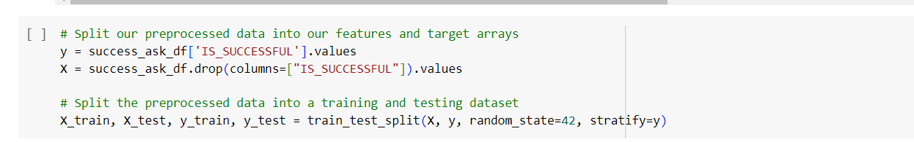

# deep-learning-challenge
Neural Networks and Deep Learning

## Report on the Neural Network Model

### Overview of the Analysis:

The purpose of this analysis is to create a binary classification model using deep learning techniques to predict whether organizations funded by Alphabet Soup will be successful based on various features provided in the dataset. The dataset contains information about more than 34,000 organizations that have received funding, including metadata such as application type, affiliation, organization classification, funding amount requested, and whether the money was used effectively.

### Data Preprocessing:

- **Target Variable:** The target variable for our model is "IS_SUCCESSFUL", which indicates whether the funding provided by Alphabet Soup was used effectively.
- **Feature Variables:** The features for our model include various metadata columns such as 'APPLICATION_TYPE', 'AFFILIATION', 'CLASSIFICATION', 'USE_CASE', 'ORGANIZATION', 'STATUS', 'INCOME_AMT', 'SPECIAL_CONSIDERATIONS', and 'ASK_AMT'.
  
- **Variables to be Removed:** The 'EIN' and 'NAME' columns were removed from the input data as they are identification columns and not relevant for model prediction.
  

### Compiling, Training, and Evaluating the Model:

**Neural Network Architecture:**
- For our neural network model, I selected 2 hidden layers with the activation function 'swish' to capture complex relationships within the data. The 'Swish' activation function performed better than ReLU. I decided to try that activation function as some of the articles on google mentioned about it. 
- The number of neurons in each layer was determined based on the number of input features and experimentation to balance model complexity and performance. The first hidden layer has 64 neurons and the second hidden layer has 32 neurons. With these numbers, the accuracy was slightly better than the lesser number of neurons.
  

**Model Performance:**
- Aimed to achieve a target model performance of higher than 75% accuracy, but was able to go up to 72.68%.
- The model was trained and evaluated using the training and testing datasets, respectively, and the loss and accuracy metrics were monitored.
  

**Steps to Increase Model Performance:**
Various optimization techniques were employed to improve model performance, including 
- adjusting input data by binning the ASK_AMT feature to have fewer bins,
  
- adding more hidden layers,
  
- using different activation functions,
  
- adding more neurons, and
  
- adjusting the number of epochs during training (Ex: 100 to 200, then to 75, finally deciding on 50).
  

### Summary:
The overall results of the deep learning model indicate that while I was able to achieve reasonable accuracy, there is still room for improvement to meet the target performance of over 75%. Despite employing various optimization techniques, including adjusting input data and tweaking model architecture, I was not able to achieve the desired performance level.

A different approach to solving this classification problem could involve exploring advanced deep learning architectures (e.g., convolutional neural networks, recurrent neural networks). More complex neural network architectures may capture intricate patterns in the data more effectively.
